# 会計WEBアプリ

## システムの導入および運用方法

[deploy-and-run-the-project.md](./deploy-and-run-the-project.md) 

## アプリの目的

- 個人または小規模事業主のための財務管理を簡素化

- 日々の収支の追跡と管理を容易に

- 効率的な財務計画のサポート

私が開発したこのアプリケーションは、個人または小規模事業主の方々が財務管理をより簡単かつ効率的に行えるよう設計されています。日々の収支の追跡から、長期的な財務計画まで、このアプリ一つで全ての管理作業をサポートします。ユーザーフレンドリーなインターフェースと、直感的な操作性により、財務状況の把握と改善を実現します。

## アプリの特徴

- **インタラクティブなダッシュボード**：直感的に操作可能なユーザーインタフェースであるため、情報の閲覧や入力がスムーズに行うことができる

- **簡単なデータ管理**：収入と支出の記録を簡単に検索、追加、編集、削除することが可能である

- **ソート機能**：記録名、種類、方式、金額、時間の各ヘッダーをクリックすることで、リストを並び替えることができる

- **明確な収支の区別**：収入と支出は色分けされており、一目で識別することができる

- **セキュリティ**：ログインおよび登録の過程において、パスワードは、一方向ハッシュアルゴリズム BCrypt を用いて暗号化され、ユーザーアカウントの安全が保たれる

- **モード切り替え機能**：デイモードとナイトモードを切り替えることができるため、昼夜を問わず快適に使用できる

さらに、収支の区別が明確になっています。収入と支出は色分けされており、ビジュアル的に即座に識別することが可能です。これにより、財務状況を迅速に把握することができます。

セキュリティ面では、ログインおよびユーザー登録の過程で、パスワードは高度な一方向ハッシュアルゴリズムであるBCryptを用いて暗号化されます。これにより、皆様のアカウントは安全に保護されます。

最後に、このアプリは昼夜を問わず使いやすいようにデイモードとナイトモードを切り替えることができるモード切り替え機能を備えています。ユーザーの目に優しく、どのような環境でも快適に利用できる設計となっています。

## システム構成

- **フロントエンド**: HTML5, CSS3, JavaScript, Bootstrap5.3, jQuery3.7.1

- **バックエンド**: Java17, Servlet, JSP, Hibernate(JPA)

- **データベース**: H2 Database

- **サーバ**: Tomcat9

次に、アプリのシステム構成についてご紹介いたします。

当アプリのフロントエンドは、最新のウェブ技術を駆使して構築されています。HTML5とCSS3を基盤に、JavaScriptで動的なユーザーインターフェイスを提供しております。デザインにはBootstrap5.3を採用し、どんなデバイス上でも見やすいレスポンシブなレイアウトを実現しています。さらに、jQuery3.7.1を使用することで、ブラウザ間の互換性を高めつつ、スムーズなユーザー体験を提供しています。

バックエンドには、安定性とパフォーマンスを重視してJava17を採用しており、ServletとJSPを用いてロバストなサーバーサイドのロジックを構築しています。データの永続性は、オブジェクトリレーショナルマッピングの標準仕様であるHibernate(JPA)を介して、簡潔かつ効率的に管理されています。

データベースには、軽量かつ高速なH2 Databaseを使用しており、開発からテスト、本番環境までの一貫したデータハンドリングを実現しています。サーバーには、信頼性の高いTomcat9を選択し、安定したアプリケーションの運用を支えています。

## スクリーンショット(ログインと登録)

ここでは、アプリのログイン画面とユーザー登録画面のスクリーンショットをご覧いただきます。

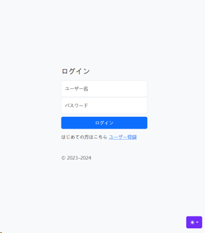

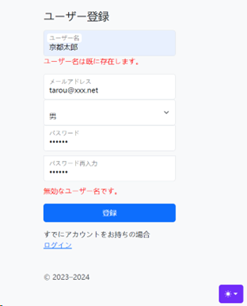

ログイン画面は、シンプルで直感的なデザインを採用しており、ユーザーが迅速にアクセスできるようになっています。必要なのはユーザー名とパスワードのみで、ワンクリックでログインが完了します。

一方、ユーザー登録画面では、新規ユーザーが必要な情報を入力し、独自のアカウントを簡単に設定できます。こちらもまた、利用者が迷わずに進めるように明瞭かつ使いやすいインターフェースを心がけています。

ここでは Ajax テクノロジーが使用されます。アジャックスは、ウェブブラウザ内で非同期通信を行いながらインターフェイスの構築を行うプログラミング手法でです。この技術により、ユーザーは自分のユーザー名が登録されているかどうかを知ることができ、各ユーザーのユーザー名が確実に一意であることが保証されます。

## スクリーンショット(会計WEBアプリ-デイモード)

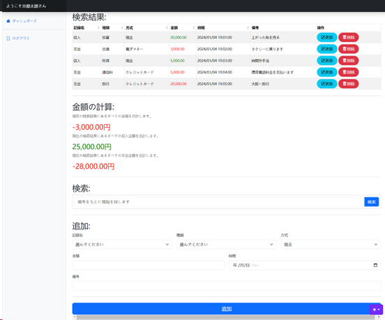

こちらはアプリのメインインターフェースのスクリーンショットです。このデイモードでは、明るく清潔感のある背景が、データの閲覧や管理を一層明瞭にします。各記録は、収入か支出かに応じて色分けされ、一目で収支の状況を把握できるようになっています。

この画面からは、ユーザーは自身の財務状況を迅速に確認できるだけでなく、新しい記録の追加や既存の記録の編集、そして不要な記録の削除まで、すべての財務管理活動を直感的に行うことができます。

さらに、ここで表示される合計金額は、ユーザーが直面している財務の健全性を即座に反映します。これにより、日々の収支の把握だけでなく、長期的な財務計画の立案にも役立つのです。

そして、「検索」の機能を使えば、「備考」欄に入力したキーワードに基づいて、過去の記録を簡単に見つけることができます。たとえば、特定の出費や収入がいつ発生したか、どのカテゴリーに属しているかをすぐに確認したい時に便利です。

このユーザーフレンドリーなインターフェースは、ユーザーにとっての使いやすさと効率性を最大限に高めることを目指しています。

## スクリーンショット(会計WEBアプリ-記録を編集)

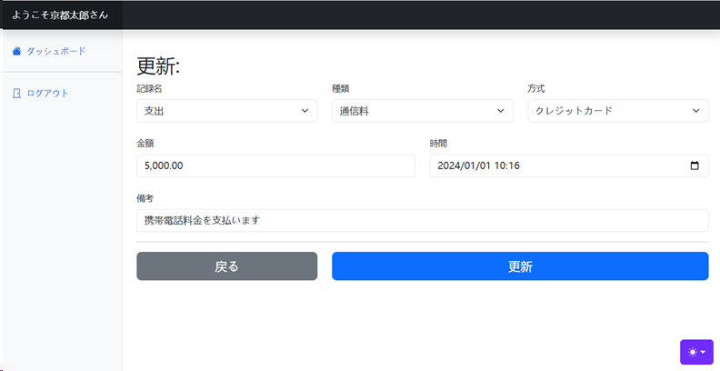

## スクリーンショット(会計WEBアプリ-ナイトモード)

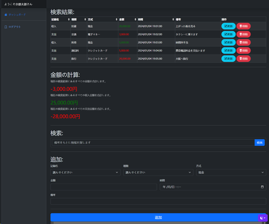

こちらはアプリのナイトモードです。このモードは、目に優しく、夜間や暗い環境での使用に最適化されています。ユーザーインターフェースは、日中モードと同じ直感的な設計を保ちつつ、暗い背景と鮮やかな文字色を使用します。

このように、ユーザーが一日中、どんな状況でも快適に使えるように配慮されているのです。

## スクリーンショット(スマートフォン-ログインと登録)

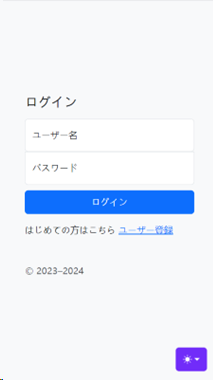

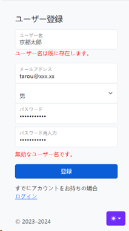

## スクリーンショット(スマートフォン-デイモード)

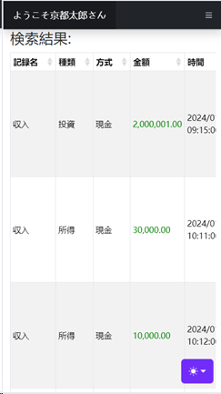

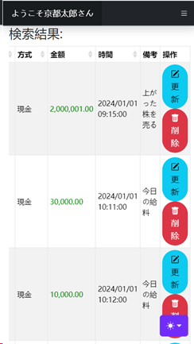

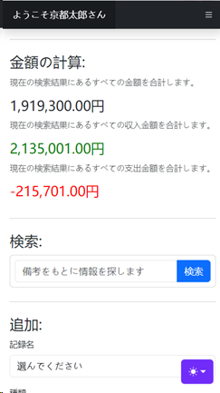

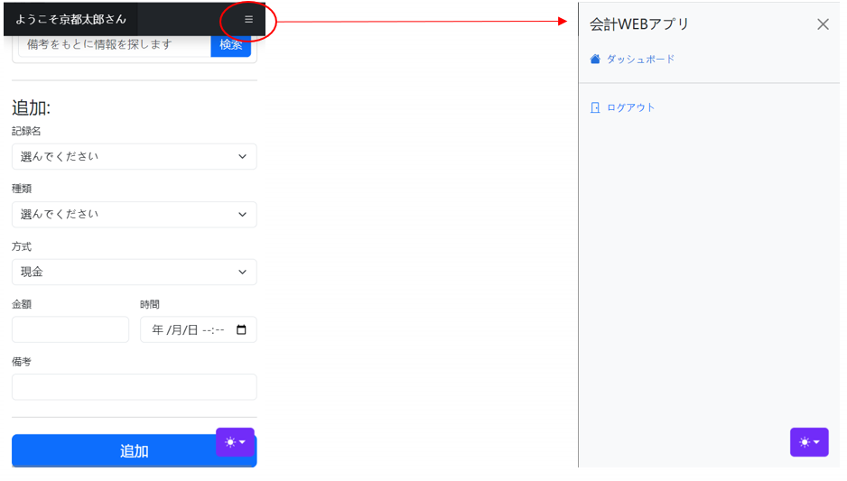

## スクリーンショット(スマートフォン-記録を編集)

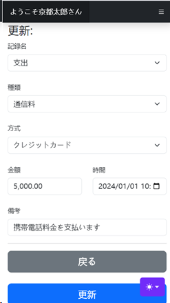

## スクリーンショット(スマートフォン-ナイトモード)

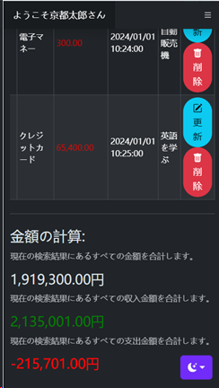
