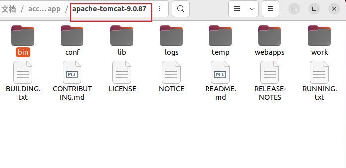

# プロジェクトをデプロイして実行する

## 動作環境

- OS: Ubuntu 22.04

- JDK: OpenJDK 17

- Tomcat: 9

- Database: H2 Database Engine

## デプロイプロセス

### 1. JDK17をインストールする

Ubuntu で次の手順を実行します。

```shell
sudo apt update 
sudo apt install openjdk-17-jdk
sudo apt install openjdk-17-jre
```

インストールが成功したかどうかを確認します。

```shell
java --version
```


**その他のケース**

デフォルトの Java バージョンの設定は、複数の Java バージョンがシステムにインストールされている状況に適しています。 まず、利用可能なバージョンをすべてリストします。

```shell
sudo update-alternatives --config java
```

数値を入力して、デフォルトのバージョンとして設定する Java バージョンを選択します。

### 2. H2 Databaseをインストールする

H2 Databaseの圧縮パッケージは以下のgithubにあります。

[accounting-web-app/database/h2.7z at main · chenxingxu3/accounting-web-app · GitHub](https://github.com/chenxingxu3/accounting-web-app/blob/main/database/h2.7z)


7z アーカイブを解凍します。


解凍したフォルダーのh2をターミナルに入力します。

例えば

```shell
cd /home/YourUserName/Document/accounting-web-app/h2
```

h2.sh に実行権限を付与します。


実行するとでてくるFailed to load module "canberra-gtk-module"というエラーの対処法

これはズバリターミナルで以下のように実行し

```shell
sudo apt-get install libcanberra-gtk*
```

h2.sh を実行します

```shell
sudo ./h2.sh
```

アクセス

http://localhost:8082/


### 3. Tomcat9をインストールする

Tomcat 9 をダウンロードします。

[Apache Tomcat - Apache Tomcat 9 Software Downloads](https://tomcat.apache.org/download-90.cgi)


tar.gzアーカイブを解凍します。


解凍したフォルダーに入り、webappsフォルダー配下のファイルをすべて削除します。


### 4. プロジェクトを実行する

パッケージ化された war パッケージを GitHub からダウンロードします。

[Release war file · chenxingxu3/accounting-web-app · GitHub](https://github.com/chenxingxu3/accounting-web-app/releases/tag/v0.0.1)


kaikei.war ファイルを webapps フォルダーにコピーします。


apache-tomcat-9.0.XX フォルダーに戻ります。



bin ディレクトリを入力します。

前の手順を参照して、startup.sh に実行権限を与えます。


binディレクトリでターミナルを実行します。


次のコマンドを実行します。

```shell
sudo ./startup.sh
```


「Tomcat started」が表示されれば起動成功です。

以下のURLにアクセスしてください

http://localhost:8080/kaikei/userlogin


